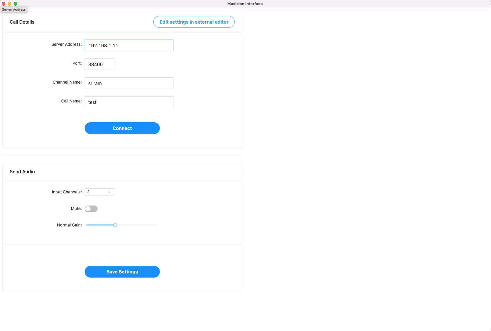

## Description

This app serves as a _controller_ for the Netty Pd(pure-data) patch.  It uses OSC (open-sound control) to send and receive data to/from the Pd patch.

The outgoing port is `3333` and the incoming port is `4444`.  This is hard-coded in the `oscService.js` file at the moment and matches the pd patch changes. If this is changed, then it needs to be changed in the corresponding Pd patch as well.

## Usage

### Pre-built app

The pre-built OSX app can be downloaded from the `Releases` section of the repository - https://github.com/FrailWords/part-ui/releases/tag/release

Only the OSX app is published at this point. For other operating systems, it will need to be built as below -

### Install Dependencies
```
yarn (or `npm install`)
```

#### Build app
```
yarn build (or `npm run build`)
```
Once the build is complete, the app will be available in the 'dist/mac' directory as a mac OSX app if you are running on OSX. It should work on Windows/Linux similary but hasn't been tested.

#### Run it in dev mode
```
yarn dev (or `npm run dev`)
```

## Interacting with the app

Once the app is up, you can click `Edit Settings` to open the settings for the app in the default `json` editor and then make the changes and manually refresh the app (Cmd+R).

Alternatively, you can make the changes in the individual input fields.

Once all the settings are done, pressing the `Connect` button should change to `Disconnect` on success connect.

To verify the interaction, you should be able to change the `input gain` for e.g. or the `mute` toggle and see that the corresponding changes happen in the Pd patch.

### Saved Settings

The settings are saved in a file named `config.json` inside the app.  Whenever the app is re-opened, the settings will be read from the file and sent to the Pd patch on initialization.
If you'd like to save settings, you can either `Edit settings in external editor` and then save the file and then refresh the app OR you can click on the `Save Settings` button and then refresh (Cmd+R) the app.

### UI sections

The left side of the app shows the controls for the `main_panel` and on the right side all the _active_ receivers will appear and their `mute`, `gain` and `packet-reset` can be controlled.

1. View when app opens up without connections -
   
2. If all fields are right, pressing on the `Connect` button successfully connects to the Netty patch running locally and also shows the incoming receivers on the right section -
   

If there are multiple incoming receivers, they will show up in the right section, with each receiver titled with their channel name in the call as well as the Pd patch number in the Netty receiver patch.

## Resources

1. This app is based on `Nextron` starter - https://github.com/saltyshiomix/nextron
2. Uses antd design library for all the components - https://ant.design/components/overview/
3. Npm module for OSC support - https://www.npmjs.com/package/osc-js

 
